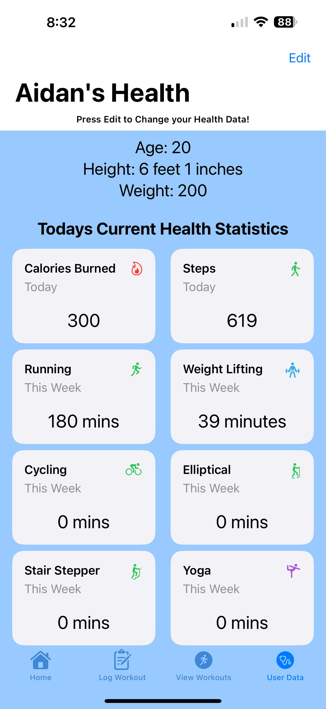

# GymBuddy
GymBuddy is an app that makes logging workouts and storing weight data easy for anyone to use from beginner to verteran lifter. This is supposed to be a simple app that gives the user the exact things that they want in a workout app. Using HealthKit I was able to get user data like past workouts and step totals. Using this aquired data I was able to put it into simple views to give the user easy accsess to all health targets that relate to the gym. This makes it super simple for a gym goer to store weight data and look at their health trends while they workout. Below is what the app looks like. 

# Link
If you want to download the app in the app store you can here!!

https://apps.apple.com/us/app/gymbuddy-log-workouts-easy/id6599854344

# Demo

When you first sign in you will be greeted with the main view which is where all the different gyms the user goes to will be entered. It will look like this.

When you tap on one of the users gyms they will be brought to the weight storage area where they can add as many workouts as they want. 

  

In another tab there is what is called the Log View where the user can log workouts they have done and create a streak which they use as motivation to go to the gym as much as they can.

With the other two tab views, this is where the user can look at their health data if they choose to share with the app. Here they will see important health data like calories burned, past workouts, and daily steps. 

  
